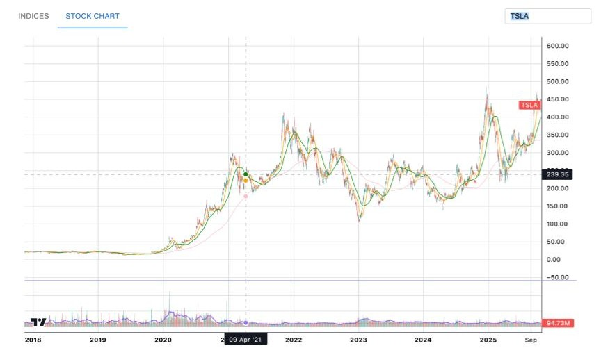

An interactive stock and index chart built with React and TradingView's lightweight-charts. It features candlestick charts with MA(50)>MA(200) breath ratio, volume histograms with 20-day averages and market indicators for major indices. A simple input to switch to different stocks

## Overall Architecture
<p align="center">
   
</p>

## Features

<div align="center">   
   
   <em>The index view includes the MA(50)>MA(200) market breadth ratio, displayed on a percent scale in the lower pane.</em>
   
    <em>The stock view includes the MA(50), MA(200) in the main pane.</em>
</div>

### Available Chart Features

- **Zoom:** Scroll mouse wheel or pinch on touchpad

- **Pan:** Click and drag on the chart```

- **Reset view:** Double-click the chart

- **Crosshair:** Hover over the chart to see precise valuesUsed combinations:

## Installation 
### Requirements

- Node.js 18+ (LTS recommended)
- npm (comes with Node.js)
- material-ui
- lightweight-charts
- react-dom 
- Modern browser (Chrome, Edge, or Firefox latest)
- Backend API reachable at http://localhost:8080
   - Endpoints expected by the app: `/stock/*`, `/index/*`, and `/market/*`

### Installation Steps
1. Clone or download this repository

2. Navigate to the project directory

3. Install dependencies:- ErrorBoundary wrapper with a friendly fallback and retry button

- Parcel-powered fast dev server and production build

```powershell

npm install

```
- React 19 + ReactDOM 19

## Quick start
Run the following command: 
```powershell

npm start 

```
Parcel will automatically open the application in your browser at `http://localhost:1234` (or another available port).


**Note:** The application expects a backend API running at `http://localhost:8080`. Ensure your backend is running before starting the frontend.

## Configuration

### API Endpoint Configuration

- Line point (indicators/breadth):

The application fetches data from `http://localhost:8080`. To change this:	- `{ time, value }`

1. Open `src/api/chartApi.js`Notes:

2. Modify the base URL in the `fetchChartData` function:

- `time` should be a Unix timestamp in seconds (UTC) compatible with lightweight-charts `UTCTimestamp`.

```javascript- Volume is optional; if provided, it enables the volume histogram.

const response = await fetch(`http://your-api-url:port/${dataType}/${resultType}/${symbol}`);
```

- The MA(50)/MA(200) breadth series is expected as a decimal ratio (e.g., 0.75 for 75%) and is rendered on a percent scale.


## Project structure
```
StockAnalyzerView/
├── .cache/                     
├── .git/                       
├── dist/                       
├── node_modules/               # NPM dependencies (generated)
├── src/                        # Source code directory
│   ├── __tests__/              # Unit test suite
│   │   ├── App.test.jsx               
│   │   ├── ChartComponent.test.jsx      
│   │   ├── ErrorBoundary.test.jsx    
│   │   ├── index.html.test.js          
│   │   └── IndexComponent.test.jsx        
│   ├── api/
│   │   └── chartApi.js         # API fetch wrapper
│   ├── utils/
│   │   ├── closest-index.ts           
│   │   ├── correlation-calculation.ts 
│   │   ├── moving-average-calculation.ts  
│   │   ├── timestamp-data.ts         
│   │   └── weighted-close-calculation.ts  
│   ├── App.js                  
│   ├── ChartComponent.jsx      
│   ├── ErrorBoundary.jsx       
│   ├── index.html              
│   ├── index.js                
│   └── IndexComponent.jsx      
├── assets/                     # Static assets
│   └── DataController.jpg      # Image used in README
├── test/
│   └── setupTests.js           
├── .gitignore                  
├── LICENSE                     
├── package.json                
└── README.md                   
```

### Customizing Chart Appearance

**Change default stock symbol:**

Edit `src/App.js`:
```javascript
const [symbol, setSymbol] = useState('AAPL'); 
```

**Change chart type (line vs candlestick):**

In `src/App.js`, modify the `ChartComponent`:
```jsx
<ChartComponent type="line" symbol={symbol} />
```

**Customize colors:**

Pass a `colors` object to components:
```jsx
<ChartComponent 
  symbol={symbol}
  colors={{
    backgroundColor: '#1e1e1e',
    lineColor: '#2962FF',
    textColor: '#d1d4dc'
  }}
/>
```

### Moving Average Configuration

Edit `src/ChartComponent.jsx` or `src/IndexComponent.jsx`:

```javascript
const movingAverages = [
  { length: 20, color: 'orange' },
  { length: 50, color: 'green' },
  { length: 200, color: 'pink' }
];
```

Modify `length` and `color` values as needed.

## Testing
1. **Start the backend API** serving data at `http://localhost:8080`
2. **Run the development server:**
   ```powershell
   npm start
   ```
3. **Manually test features:**
   - Switch between Indices and Stock Chart tabs
   - Change index selections (SPX, NDX, DJI)
   - Enter different stock symbols and verify charts load
   - Test zoom, pan, and crosshair interactions
   - Verify moving averages and volume histograms render correctly
   - Test error handling by stopping the backend

### Troubleshooting

**Blank chart or loading errors:**
- Ensure backend is running at `http://localhost:8080`
- Check browser console for network errors
- Verify API returns data in the correct format

**Incorrect timestamps:**
- lightweight-charts expects **seconds** since epoch (UTC)
- If using milliseconds, divide by 1000

**Volume not displaying:**
- Ensure `volume` field is present in candlestick data

**Parcel build issues:**
- Delete `.cache` and `dist` folders
- Reinstall dependencies: `npm install`
- Restart dev server: `npm start`

## Contact & Additional Information

**License:** MIT License (see `LICENSE` file)

**Technologies:**
- [React](https://react.dev/) - UI framework
- [Material-UI](https://mui.com/) - Component library
- [lightweight-charts](https://tradingview.github.io/lightweight-charts/) - TradingView charting library
- [Parcel](https://parceljs.org/) - Zero-config bundler

**Contributing:**

1. Fork this repository
2. Create a feature branch
3. Make your changes
4. Submit a pull request

**Known Limitations:**
- API base URL is hardcoded (consider environment variables for production)
- No automated end-to-end tests
- Backend must be running locally

## Further Enhancements
### Feature Enhancements

1. **Additional Technical Indicators**
   - RSI (Relative Strength Index)
   - MACD (Moving Average Convergence Divergence)
   - Bollinger Bands
   - Stochastic Oscillator
   - Fibonacci retracements

2. **Timeframe Selection**
   - Add buttons for common timeframes (1D, 1W, 1M, 3M, 1Y, All)
   - Support custom date range selection with calendar picker

3. **Comparison Mode**
   - Overlay multiple stocks on a single chart
   - Percentage-based comparison from a common starting point
   - Compare stock performance against major indices

4. **Drawing Tools**
   - Trend lines and channels
   - Annotations and text labels
   - Measurements and retracement tools

5. **Alerts & Notifications**
   - Price alerts (above/below target)
   - Technical indicator alerts (RSI overbought/oversold)
   - Volume spike notifications
   - Browser notifications API integration

6. **Watchlist & Portfolio**
   - Create and manage multiple watchlists
   - Track portfolio holdings with P&L calculations
   - Sort and filter by various metrics (% change, volume, etc.)

### Testing & Quality Assurance

1. **Visual Regression Testing**
   - Use tools like Percy or Chromatic to catch UI regressions
   - Capture screenshots of charts in different states
   - Test responsive layouts across viewport sizes

2. **Performance Testing**
   - Measure chart rendering performance with large datasets
   - Profile React component re-renders
   - Test memory usage with lighthouse-charts over extended periods

### Architecture & Performance

1. **Real-Time Data**
   - Implement WebSocket connection for live price updates
   - Auto-refresh charts without full page reload
   - Show real-time volume and last trade information

2. **Chart Performance**
   - Implement data decimation for large datasets
   - Use web workers for heavy calculations (indicators)
   - Optimize moving average calculations with incremental updates

### User Experience

1. **Dark Mode / Themes**
   - Toggle between light and dark themes
   - Custom color scheme editor
   - Save theme preferences to localStorage

2. **Customizable Layouts**
   - Drag-and-drop panel arrangement
   - Save and load custom layouts
   - Multiple workspace tabs

3. **Export Capabilities**
   - Export charts as PNG/SVG images
   - Download historical data as CSV
   - Share chart snapshots with unique URLs

---

Built with React, Material-UI, and lightweight-charts by TradingView.
